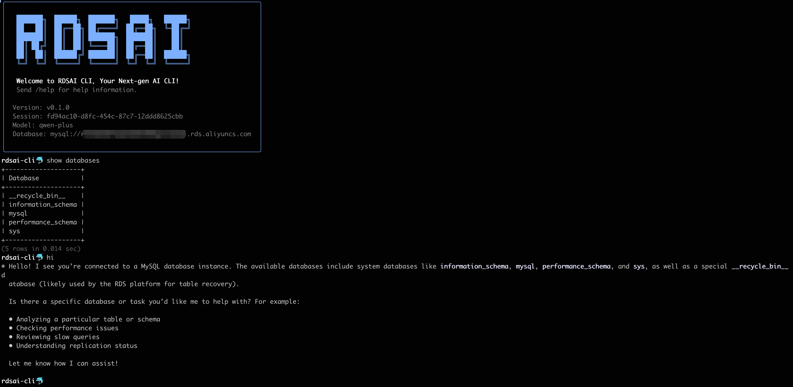

<div align="center">

# RDSAI CLI

**AI-Powered Database Command-Line Interface**

[](https://www.python.org/downloads/)
[](https://github.com/aliyun/rdsai-cli/blob/main/LICENSE)
[](https://github.com/aliyun/rdsai-cli/stargazers)
[](https://github.com/aliyun/rdsai-cli/issues)

[English](README.md) | [中文](README_zh.md)



<p>
RDSAI CLI is an AI-powered command-line interface for database management.<br>
It supports natural language queries and SQL execution, with built-in diagnostic tools,<br>
execution plan analysis, and multi-source data connections.
</p>

</div>

---

## Features

- **Multi-Source Connection** - Connect to MySQL databases or files (CSV, Excel) locally or remotely via HTTP/HTTPS
- **AI Assistant** - Natural language queries (English/Chinese), SQL optimization, diagnostics, and explanations
- **Smart SQL** - Auto-detects SQL vs natural language, query history, Ctrl+E for instant result explanations
- **Multi-Model LLM** - Support for Qwen, OpenAI, DeepSeek, Anthropic, Gemini, and OpenAI-compatible APIs
- **Schema Analysis** - AI-powered database analysis with compliance checking and optimization suggestions
- **Performance Benchmarking** - Automated sysbench testing with comprehensive analysis reports
- **MCP Integration** - Extend capabilities via Model Context Protocol servers
- **Safety First** - Read-only by default, DDL/DML requires confirmation (YOLO mode available)

## Requirements

- Python 3.13+
- Network access to RDS instance (MySQL)
- API access to LLM provider

## Installation

```bash
# One-click installation (recommended)
curl -LsSf https://raw.githubusercontent.com/aliyun/rdsai-cli/main/install.sh | sh

# Or using uv
uv tool install --python 3.13 rdsai-cli

# Or using pip (recommend virtual environment)
pip install rdsai-cli
```

## Quick Start

### Launch and Connect

```bash
# Start without connection (interactive mode)
rdsai

# Connect via command line
rdsai --host localhost -u root -p secret -D mydb

# Connect to files
rdsai
> /connect flights.csv
> /connect https://example.com/data.csv
```

### Configure LLM

```text
mysql> /setup
```

Interactive wizard will guide you through LLM provider setup. Configuration is saved to `~/.rdsai-cli/config.json`.

### Basic Usage

**SQL Execution:**

```text
mysql> SELECT COUNT(*) FROM users;
mysql> EXPLAIN SELECT * FROM users WHERE email = 'test@example.com';
mysql> SELECT * FROM users LIMIT 10\G   -- Press Ctrl+E for AI explanation
```

**Natural Language:**

```text
mysql> analyze index usage on users table
mysql> show me slow queries from the last hour
mysql> design an orders table for e-commerce
mysql> why this query is slow: SELECT * FROM users WHERE name LIKE '%john%'
```

### Meta Commands

| Command | Description |
|---------|-------------|
| `/connect`, `/disconnect` | Connect/disconnect from database or files |
| `/setup` | Configure LLM provider |
| `/help` | Show help and status |
| `/explain` | Analyze SQL execution plan |
| `/research` | Generate database schema analysis report |
| `/benchmark` | Run performance benchmark test |
| `/yolo` | Toggle auto-approve mode (use with caution) |
| `/history` | Show query history |
| `/model` | Manage LLM models |

## Documentation

- [Complete Tutorial](docs/tutorial.md) - Comprehensive guide from beginner to advanced
- [Core Features](docs/features/) - Execution plan analysis, schema analysis, benchmarking, MCP integration
- [Usage Scenarios](docs/scenarios/) - SQL explanation, file analysis, slow query optimization, and more

## Security

- **Read-Only by Default** - DDL/DML require explicit confirmation unless YOLO mode is enabled
- **Confirmation Required** - Every write operation shows exact SQL for review before execution
- **Credential Storage** - API keys stored in `~/.rdsai-cli/config.json` (protect with proper permissions)

## Contributing

We welcome contributions. See [CONTRIBUTING.md](CONTRIBUTING.md) for details.

## Star History

<div align="center">

[](https://star-history.com/#aliyun/rdsai-cli&Date)

</div>

## License

MIT License - see [LICENSE](LICENSE) for details.
